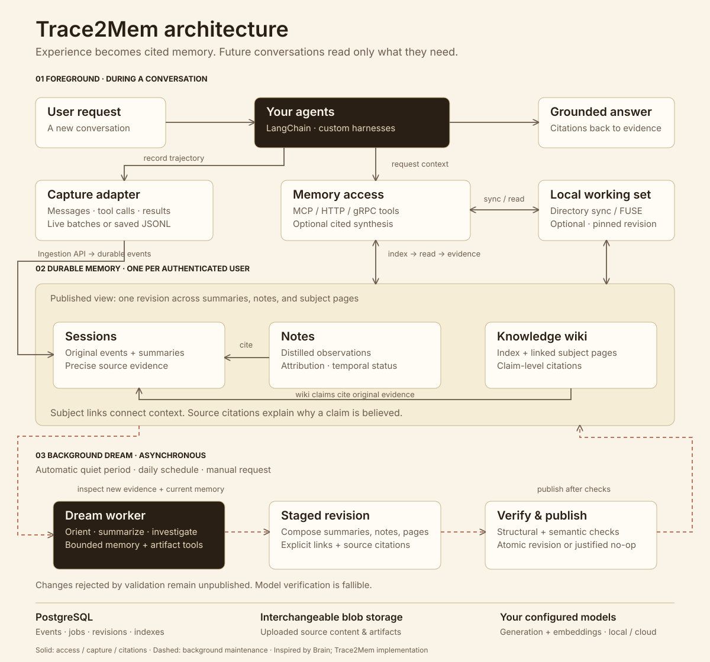

# Trace2Mem

**Persistent, cited memory for your agents, across conversations.** Trace2Mem is an experimental, self-hosted Go service inspired by Brain, licensed under Apache-2.0.

## Why it exists

A new agent conversation often starts without the decisions, preferences, corrections, and tool observations from earlier conversations. Sending the entire history again consumes context and makes it harder to find what is current and why it is believed.

Trace2Mem accepts those events, preserves the originals, and maintains session summaries, observations, and a linked Markdown knowledge wiki. Your agent starts with a small index and reads relevant pages and evidence as needed. One authenticated user has one memory shared across their agents.

## How it works



Capture and retrieval are separate integrations. An adapter sends events during a conversation or imports them later. Dream investigates accumulated evidence, stages an update, verifies it, and publishes a revision. Your agent retrieves from that revision; new events become available after compilation. Connecting MCP alone does not capture conversations or insert initial context.

## Choose your starting point

| You want to… | Start here |
|---|---|
| Run the service and configure models | [Docker quickstart](docs/QUICKSTART.md) |
| Connect a custom agent in any language | [Capture and retrieval walkthrough](docs/INTEGRATION.md) |
| Capture LangChain conversations | [Python reference integration](integrations/langchain/README.md) |
| See a real model learn and recall | [Kimi exercise](docs/KIMI_AGENT.md) and [recorded results](reports/2026-09-08-harbor/README.md) |
| Understand the design or contribute | [Architecture](docs/ARCHITECTURE.md), [contributing](CONTRIBUTING.md), and [documentation index](docs/README.md) |

Use Trace2Mem when you control your agent's event capture and want self-hosted, inspectable memory. It does not replace your agent harness. Pi/Hermes adapters are not yet implemented; the framework-neutral API is available. Linux FUSE is optional—MCP, HTTP, and ordinary directories also work.

**Status:** locally validated experimental MVP, not a production release. A small [paired evaluation](docs/EVALUATION.md) did not establish an advantage over the baseline. The richer Kimi exercise recalled corrected requirements but exposed a historical interpretation error. See [implemented guarantees and limitations](docs/IMPLEMENTATION.md); no Brain-equivalent quality, speed, or cost claim is made.

## Local Docker

```sh
make dev-up
make bootstrap-token
```

Open http://localhost:8787 and use the printed bootstrap token. Ports bind to loopback. Set `TRACE2MEM_PORT=18787` if 8787 is occupied. Compose initializes one persistent secrets volume shared by API and worker; do not delete it without backing up its encryption key. The PostgreSQL and blob volumes persist across restarts.

Build the CLI with `make build`. Set `TRACE2MEM_URL=http://localhost:8787` and `TRACE2MEM_TOKEN` to the Docker bootstrap token. Your memory is provisioned automatically from your credentials. Use `bin/trace2mem` when running from this checkout.

## Mandatory model configuration

No real model is selected automatically. Each user must configure both generation and embedding roles. They may use different providers and locations. Copy one of:

- `configs/models.local.example.yaml`: local Ollama generation and embeddings.
- `configs/models.gemini.example.yaml`: generation plus Gemini API-key embeddings.
- `configs/models.vertex.example.yaml`: generation plus Vertex AI embeddings using application default credentials.

Replace every placeholder with a model available to your account or installed locally. API keys are referenced by environment variable, never embedded in YAML. Then:

```sh
bin/trace2mem configure --file models.yaml
```

Configuration probes tool calling, structured tool arguments, and embeddings. Missing models, placeholders, floating `latest` names, unsupported providers, and unapproved custom endpoints are rejected. Generation currently supports OpenAI Responses and native Ollama; embeddings support OpenAI, Ollama, Gemini, and Vertex. Vertex uses IAM credentials of the running process; Terraform grants API/worker identities Vertex access. API-key and IAM embedding protocols are separate adapters.

Changing embedding provider/model/dimensions/endpoint/project/location queues a complete reindex. The current configuration remains active until the new vectors and revision publish atomically. A failed reindex keeps the previous revision usable; retry compilation after resolving the reported error. Long texts use bounded UTF-8 chunks and normalized pooling; this algorithm is versioned in the embedding identity and its retrieval quality still requires evaluation.

## Agent interfaces

`proto/trace2mem/v1/trace2mem.proto` defines the versioned contract. `sdk` includes a Go client, Adapter interface, and Protobuf-JSON JSONL importer. User adapter code runs outside the service.

```sh
bin/trace2mem import --file fixtures/history.jsonl
bin/trace2mem status
bin/trace2mem search --query 'project deadline'
bin/trace2mem context --query 'project deadline' --target ./working-set
bin/trace2mem sync --target ./snapshot
```

MCP endpoint: `/mcp`, using an authenticated streamable HTTP connection. Tools: `memory_index`, `memory_search`, `memory_read`, `memory_evidence`, `memory_context`, `memory_status`. Connecting MCP does not capture trajectories or automatically inject context. Use an adapter to submit events and `context` to prepare a cited working set.

The API supports Connect JSON and gRPC through the same handlers. Compilation is asynchronous: durable acceptance does not imply wiki freshness. Responses carry revision and watermark. Filesystem snapshots pin one revision; `context --target` downloads supporting files plus the index, while `sync` materializes all files.

## Verification

```sh
make test                 # unit/race tests; external profiles skip without configuration
make test-e2e             # Docker scripted provider, no cloud credentials
make test-fuse            # after test-e2e; uses its isolated fixture user
make terraform-check
```

The deterministic provider requires `TRACE2MEM_ALLOW_SCRIPTED=true` and is a fixture, not an inference model. Real model tests are opt-in (`tests/live`) and require explicit generation and embedding models, endpoints, credentials, and budgets. They do not run in ordinary unit tests.

Read [architecture](docs/ARCHITECTURE.md), [operations](docs/OPERATIONS.md), and [implementation/validation status](docs/IMPLEMENTATION.md). The Go module namespace `github.com/trace2mem/trace2mem` is a placeholder until a public repository owner is selected.

For a capability check using the same YAML: `TRACE2MEM_LIVE_CONFIG=/absolute/path/models.yaml make test-model`. This makes real provider calls; use your intended account and budget. Docker startup does not select or download a real model.

OpenRouter users can copy `configs/models.openrouter-vertex.example.yaml`. The generation provider is `openai` because this selects the Responses protocol; the endpoint selects OpenRouter. Add `https://openrouter.ai/api/v1` to the operator's `TRACE2MEM_MODEL_ENDPOINTS`. Vertex uses ADC in the process running the test; host ADC is not automatically available inside Docker. The sample's `us-central1` is an embedding location independent of the service deployment region. Review it for your data-location requirements.

## Per-user contract upgrade

This pre-release API removes spaces, memberships, `space_id`, and `--space`. Upgrade clients together with the server. Legacy selectors are rejected; old histories are not automatically merged. Preserve old volumes and start with fresh database/blob namespaces. Internal SQL column names still use `space` as a memory storage key; they do not permit selecting another user.

Agent credentials belong to one user. Scopes are `read`, `ingest`, and `manage`; token creation requires `manage` and cannot grant scopes the issuer lacks. Verified OIDC identities include issuer and subject. The local bootstrap token owns only its local user memory. See the in-app `/guide` for capture and retrieval instructions.

The per-user Brain-aligned MVP is implemented and locally validated. Dream summaries and explicit relationship proposals are implemented with deterministic tests. Automatic, daily and manual scheduling are available in Settings or `trace2mem schedule`. The [LangChain adapter](integrations/langchain/README.md) has passed callback, durability, and Docker integration checks; consult [implementation status](docs/IMPLEMENTATION.md).

Automatic compilation waits for 60 seconds without new events, with a five-minute maximum delay; closing a session requests immediate compilation. Daily mode defaults to 02:00 UTC and coalesces missed runs after downtime. Manual mode accepts events until an explicit `trace2mem compile`. Changing the schedule does not cancel already approved work. Missing models block compilation while preserving accepted evidence.

```sh
bin/trace2mem schedule --mode daily --at 02:00 --timezone Europe/London
bin/trace2mem schedule
```
