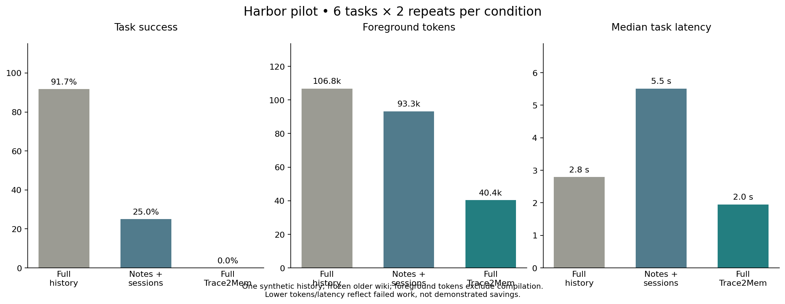

# Harbor: matched memory-dependent tasks

A synthetic development pilot: six tasks, three conditions, two repeats per task. All conditions use fresh Kimi processes and the same task prompts and foreground budget. The baseline receives the complete original history; it has memory. Other conditions read the same checkpoint through permitted file tools.

The saved wiki predates the latest Dream verification changes. This measures consuming-agent behavior over that export, not new compilation quality, a production integration, or independent held-out generalization.

| Condition | Tasks passed | Fields correct | Execution failures | Median latency | Accounted tokens |
|---|---:|---:|---:|---:|---:|
| Full original history | 11/12 | 55/56 | 0 | 2.80 s | 106,778 |
| Notes + sessions | 3/12 | 21/56 | 4 | 5.51 s | 93,280 |
| Full Trace2Mem | 0/12 | 3/56 | 3 | 1.95 s | 40,396 |

## Deltas

Wiki minus comparison condition. Lower tokens or latency alongside failed tasks are not demonstrated savings or faster successful work.

| Comparison | Task success change | Field accuracy change | Accounted token change | Median latency change |
|---|---:|---:|---:|---:|
| Full Trace2Mem vs Full original history | -91.7 pp | -92.9 pp | -62.2% | -30.3% |
| Full Trace2Mem vs Notes + sessions | -25.0 pp | -32.1 pp | -56.7% | -64.6% |

## By task

| Task | Full history | Notes + sessions | Full Trace2Mem |
|---|---:|---:|---:|
| release-config | 2/2 | 1/2 | 0/2 |
| decision-history | 1/2 | 0/2 | 0/2 |
| operations | 2/2 | 1/2 | 0/2 |
| owners | 2/2 | 0/2 | 0/2 |
| unknowns | 2/2 | 1/2 | 0/2 |
| launch-lookup | 2/2 | 0/2 | 0/2 |

## Observed agent behavior

The notes/session agent made no memory-tool call in 5/12 trials; the wiki agent made none in 10/12. In this pilot, making tools available did not reliably cause retrieval. Several other trials produced malformed final output; one exhausted its conservative retrieval budget. These are end-to-end agent failures, not evidence that wiki content is intrinsically worse after successful retrieval.

The single full-history failure labeled the initial outbox status proposed rather than approved. The rubric targets the original user decision (harbor-0011), but the earlier assistant proposal (harbor-0010) makes the word initial potentially ambiguous. This guided development rubric should not be treated as an independent semantic judgment.

The next controlled protocol should verify tool use and structured finalization before comparing memory quality, retain this failed pilot, and use new held-out histories after development. It must not silently replace these trials with favorable reruns.

## Failures and incorrect fields

- release-config / Full Trace2Mem / repeat 1: invalid_artifact.
- decision-history / Notes + sessions / repeat 1: token_budget.
- decision-history / Full Trace2Mem / repeat 1: invalid_artifact.
- operations / Full Trace2Mem / repeat 1: alert_age_seconds, pause_age_seconds, pause_noncritical_only, replay_requires_mitigation, delivery_semantics, deduplication_key.
- owners / Notes + sessions / repeat 1: invalid_artifact.
- owners / Full Trace2Mem / repeat 1: receiver_outbox_owner, consumers_load_testing_owner, operations_owner.
- unknowns / Notes + sessions / repeat 1: invalid_artifact.
- unknowns / Full Trace2Mem / repeat 1: monthly_budget_ceiling_eur, kafka_approved, storage_expansion_approved.
- launch-lookup / Full Trace2Mem / repeat 1: launch_date.
- launch-lookup / Notes + sessions / repeat 1: invalid_artifact.
- release-config / Notes + sessions / repeat 2: language, queue, launch_date, raw_retention_days, metadata_retention_days, peak_events_per_second, consumer_count, eu_only.
- release-config / Full Trace2Mem / repeat 2: language, launch_date, raw_retention_days, metadata_retention_days, peak_events_per_second, consumer_count.
- decision-history / Full Trace2Mem / repeat 2: original_launch_date, current_launch_date, original_consumer_count, current_consumer_count, initial_outbox_status, approving_actor.
- decision-history / Full original history / repeat 2: initial_outbox_status.
- decision-history / Notes + sessions / repeat 2: original_launch_date, current_launch_date, original_consumer_count, current_consumer_count, initial_outbox_status, approving_actor.
- operations / Notes + sessions / repeat 2: alert_age_seconds, pause_age_seconds, deduplication_key.
- operations / Full Trace2Mem / repeat 2: alert_age_seconds, pause_age_seconds, pause_noncritical_only, replay_requires_mitigation, delivery_semantics, deduplication_key.
- owners / Notes + sessions / repeat 2: receiver_outbox_owner, consumers_load_testing_owner, operations_owner.
- owners / Full Trace2Mem / repeat 2: receiver_outbox_owner, consumers_load_testing_owner, operations_owner.
- unknowns / Full Trace2Mem / repeat 2: invalid_artifact.
- launch-lookup / Notes + sessions / repeat 2: launch_date.
- launch-lookup / Full Trace2Mem / repeat 2: launch_date.

## Accounting and limits

Foreground tokens cover all recorded calls, including failed trials. Estimated/unresolved usage is a conservative reservation, not a provider invoice. Outer-process failures may lack usage; no cost saving can be inferred from missing usage.

- Full original history: 0 estimated, 0 unresolved, 0 missing-usage trials.
- Notes + sessions: 0 estimated, 0 unresolved, 0 missing-usage trials.
- Full Trace2Mem: 0 estimated, 0 unresolved, 0 missing-usage trials.

No new compilation or embedding calls occurred. Preparing the existing checkpoint previously used 87,159 input + 13,443 output generation tokens and 240,044 estimated embedding tokens; that historical total excludes original planning and earlier failed attempts. Both file-memory conditions share this existing pipeline expense. The full-history baseline has no compilation expense. Monetary cost per successful task is unreported because no price schedule or complete historical bill is available.

All tasks come from one known two-session history, with explicit field prompts and two repeats. Differences are descriptive and correlated; no significance or generalization claim is made. Exact fields are scored independently of citation IDs. A correct value with an unsupported citation can still pass; semantic support requires a separate assessment. Keyword file search is used, not live API/semantic retrieval. Latency includes process startup, file verification, tools and provider time; network variation and provider cache effects remain. Reproduction requires the same snapshot and configuration; hosted weights/routing can change.

## Reproduce and audit

- [Complete trial results and traces](results.json)
- [Machine-readable summary](summary.json)
- [Frozen protocol and commands](../../evaluation/harbor/README.md)
- [Questions and gold fields](../../evaluation/harbor/suite.json)
- [Original evidence ledger](../../evaluation/harbor/evidence-ledger.json)
- [Prior compilation and known wiki defect](../2026-09-08-harbor/README.md)

Private input report SHA-256: `58425b4cd61781a2f522327f4332dee95b46a82004058fb30fe3df1d99d8fe22`. Opaque provider resume handles in message text are redacted in the shared trace; no task, gold value, memory page, artifact or score was changed after observing these trials.
