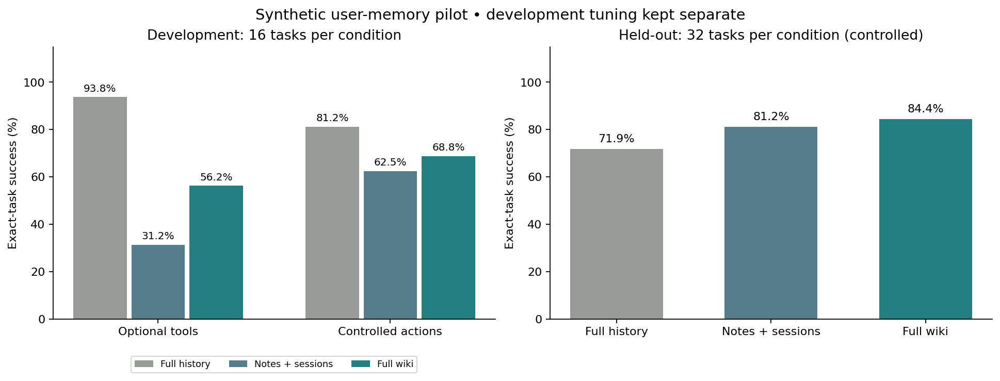

# User-history memory evaluation

Four authored synthetic users, six conversations and eight questions each. Two users were used for development; the other two were evaluated only after candidate selection. The same task templates are shared across users, so this is held-out persona evaluation within a narrow distribution, not broad generalization or a reproduction of Brain's proprietary benchmark.

The [failure audit and interpretation](RCA.md) show that the small score advantage comes from execution and exact-format differences; broad semantic gains remain unproven.

## Development hill-climb

Candidate A uses optional memory tools. Candidate B requires a structured action and a successful memory read before answering in file-memory conditions; cited sources must be resolved. Generation settings are matched. Within each candidate, its full-history baseline uses that candidate's finalization protocol. The gold answers and questions were frozen before foreground inference. The protocol hypothesis follows the earlier Harbor failure analysis; this development run tests and selects it.

| Candidate | Full-history tasks | Notes/session tasks | Wiki tasks | Notes/wiki execution errors | Notes/wiki tokens |
|---|---:|---:|---:|---:|---:|
| optional | 15/16 | 5/16 | 9/16 | 8 | 155,730 |
| controlled | 13/16 | 10/16 | 11/16 | 9 | 525,496 |

The pre-registered rule selected **controlled**: maximize combined notes/wiki task successes, then minimize execution errors, then compare usage with uncertainty penalized. The selected configuration was frozen before held-out inference. This is one development candidate change, not an open-ended search for favorable results.

## Root-cause evidence

- optional / Notes + sessions: 8/16 trials without a successful file read; execution failures: invalid_artifact: 5.
- optional / Full wiki: 6/16 trials without a successful file read; execution failures: invalid_artifact: 3.
- controlled / Notes + sessions: 1/16 trials without a successful file read; execution failures: step_budget: 1, provider_failure: 5.
- controlled / Full wiki: 1/16 trials without a successful file read; execution failures: step_budget: 2, provider_failure: 1.

The strict JSON scorer rejects prose preambles and malformed artifacts even when they contain correct facts. Exact-task success requires successful JSON parsing and all expected answer values; gold-citation agreement is reported separately and is not part of that score. It is not a blanket judgment of semantic knowledge or complete citation support. The controlled candidate changes both tool-use and finalization, so their individual causal contributions are not isolated.

All supplied compilation attempts, including failures and repairs, are retained below. Compilation failures are separate from foreground task scores; a publishable revision is required before the comparison starts.

## Held-out results

| Condition | Tasks correct | Fields correct | Gold-source coverage¹ | Gold-citation agreement² | Median latency³ | Foreground tokens |
|---|---:|---:|---:|---:|---:|---:|
| Full history | 23/32 | 60/80 | N/A | 81.2% | 17.85 s | 277,483 |
| Notes + sessions | 26/32 | 65/80 | 95.0% | 81.2% | 19.83 s | 504,726 |
| Full wiki | 27/32 | 67/80 | 87.5% | 85.0% | 14.96 s | 380,018 |

¹ Fraction of expected answer fields for which an acceptable gold source was completely read. Repeated fields can share a source; this is not unique-event recall. Full-history exposure is not a tool read, so its retrieval metric is N/A.

² Fraction of fields citing at least one acceptable gold event ID. This checks source agreement, not independent semantic support or the correctness of every additional cited claim.

³ Medians exclude interrupted trials with unknown latency; counts are disclosed below. Lower latency/tokens on failed work do not establish savings.

## Held-out deltas

| Full wiki compared with | Task-success change | Field-correctness change | Foreground token change |
|---|---:|---:|---:|
| Full history | +12.5 pp | +8.8 pp | +37.0% |
| Notes + sessions | +3.1 pp | +2.5 pp | -24.7% |

## Held-out categories

| Category | Full history | Notes + sessions | Full wiki |
|---|---:|---:|---:|
| authority | 3/4 | 4/4 | 3/4 |
| cross_session | 3/8 | 6/8 | 6/8 |
| currentness | 3/4 | 4/4 | 4/4 |
| preferences | 3/4 | 3/4 | 4/4 |
| single_fact | 3/4 | 3/4 | 4/4 |
| temporal | 4/4 | 3/4 | 3/4 |
| unknown | 4/4 | 3/4 | 3/4 |

## Accounting and failures

| Compilation attempt | Persona | Published | Generation tokens | Estimated embedding tokens |
|---|---|---|---:|---:|
| snapshots | leena | True | 36,203 | 69,796 |
| snapshots | marco | True | 26,767 | 62,148 |
| snapshots | nadia | False | 28,070 | 0 |
| snapshots | owen | True | 33,410 | 64,028 |
| repair | nadia | True | 25,927 | 56,167 |

Recorded foreground usage across development and held-out trials: **1,973,310 tokens**. Recorded compilation usage across all retained attempts: **402,516 tokens**, including estimated embeddings. No monetary cost or break-even claim is made: no price schedule is supplied, and hosted cache billing may differ from token accounting. Authored histories did not require model generation.

- Held-out Full history: errors {"provider_failure": 5, "step_budget": 1}; 0 missing-usage, 0 unresolved-usage, 0 incomplete-latency trials.
- Held-out Notes + sessions: errors {"provider_failure": 2, "step_budget": 1, "token_budget": 2}; 0 missing-usage, 0 unresolved-usage, 0 incomplete-latency trials.
- Held-out Full wiki: errors {"provider_failure": 3, "step_budget": 1}; 0 missing-usage, 0 unresolved-usage, 0 incomplete-latency trials.
- leena-briefing / Full history / repeat 1: provider_failure.
- leena-coordinator / Notes + sessions / repeat 1: provider_failure.
- owen-preferences / Full history / repeat 1: provider_failure.
- owen-preferences / Notes + sessions / repeat 1: step_budget.
- owen-current-date / Full history / repeat 1: step_budget.
- owen-date-change / Full wiki / repeat 1: reason.
- owen-organizations / Full wiki / repeat 1: provider_failure.
- owen-organizations / Full history / repeat 1: provider_failure.
- owen-proposal-status / Full history / repeat 1: provider_failure.
- owen-proposal-status / Full wiki / repeat 1: step_budget.
- owen-briefing / Notes + sessions / repeat 1: token_budget.
- owen-briefing / Full history / repeat 1: organization, format.
- owen-hotel / Full wiki / repeat 1: provider_failure.
- owen-hotel / Notes + sessions / repeat 1: provider_failure.
- owen-coordinator / Full history / repeat 1: provider_failure.
- leena-briefing / Full history / repeat 2: organization.
- owen-date-change / Notes + sessions / repeat 2: reason.
- owen-briefing / Full wiki / repeat 2: provider_failure.
- owen-briefing / Full history / repeat 2: organization, format.
- owen-briefing / Notes + sessions / repeat 2: token_budget.

## Interpretation limits

Only two held-out personas and shared task templates were tested. Dates, entities and status fields are exact-value checks; the reason clause must be copied verbatim. Semantically equivalent paraphrases can fail, and a correct field does not prove all accompanying claims. No independent semantic judge or confidence interval is claimed. All scheduled attempts, including failures, remain in the denominator.

The comparison uses the real Dream-generated wiki and a consuming agent over hash-verified directory snapshots. Search is bounded keyword matching, not live API or embedding retrieval. Six conversations are compiled together in one initial run per persona; this does not measure incremental publication freshness. Full history fits comfortably in context and is deliberately a strong baseline. The histories contain authored user/assistant messages, not executed external-tool tasks. Snapshot export/preparation time is outside foreground latency. Deployment, public hosting and native macOS FUSE are outside this evaluation.

## Reproduce and inspect

- [Dataset and pre-registered protocol](../../evaluation/personas/README.md)
- [Offline artifact-score verifier](../../evaluation/persona_verify.py) — run with `--report evaluation/heldout.json` from this report directory; no model calls.
- [Frozen suite/binary/manifest hashes](../../evaluation/personas/frozen/freeze.json)
- [Candidate selection](evaluation/selection.json)
- [All metrics and compilation accounting](summary.json)
- [Source hashes before provider-handle redaction](source-hashes.json)
- [Generated memory snapshots](corpus/)
- [Complete evaluation checkpoints](evaluation/)
- [Compilation attempts and verifier diagnostics](compilation/)

Opaque provider continuation handles in message text are redacted; answer artifacts and measured scores are preserved. No real-user histories or credentials are intentionally included.
